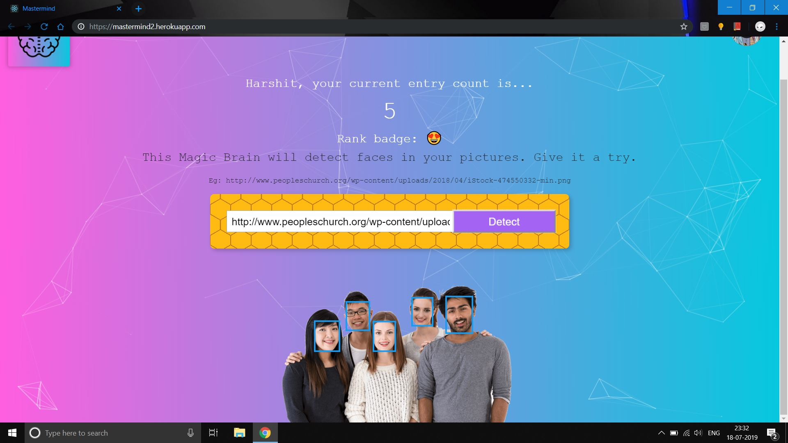
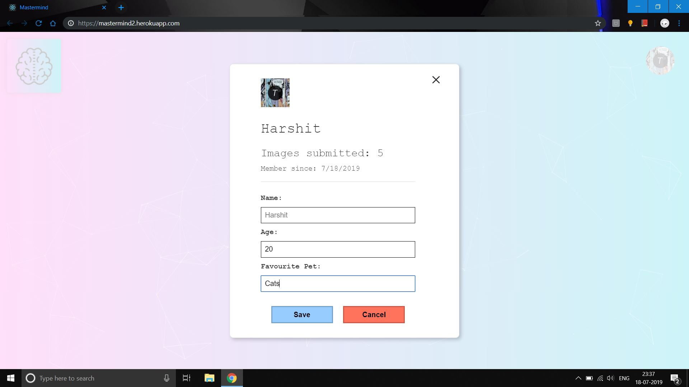
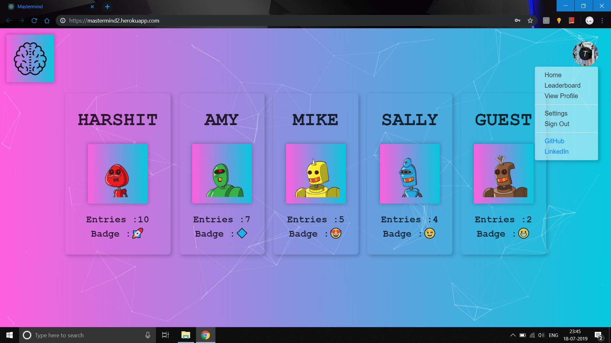

# Mastermind 2.0 (Backend)

> This is a web application which uses machine learning to detect faces in your images with provisions for registering, signing in, viewing the leaderboard.

> This repository hosts the code for the backend. Code for the React application can be found at https://github.com/hmahajan99/Mastermind2-frontend.
For the previous version of this app, Mastermind 1.0 see https://github.com/hmahajan99/Mastermind.

> Deployed at https://mastermind2.herokuapp.com/

## This project consists of :
<ul>
<li><b>Face Detection: </b>Using Clarifai</li>
<li><b>Frontend: </b>Built using React</li>
<li><b>Server: </b>Built using Express framework</li>
<li><b>Database: </b>PostgreSQL, for storing user data</li>
<li><b>Session Management: </b>Using Redis and JSON Web Tokens</li>
<li><b>Docker: </b>Used during development to run containers for the server,postgres and redis</li>
</ul>

To run this project :
1. Clone this repo
2. Change you directory : `cd Mastermind2-backend`
3. Set up environment variables by declaring them in a .env file in the root directory. 
4. If the docker container is unable to recognize node modules run `npm install`
5. Run `docker-compose up --build`

#### Face Detection :

#### User Profile :

#### Leaderboard :

